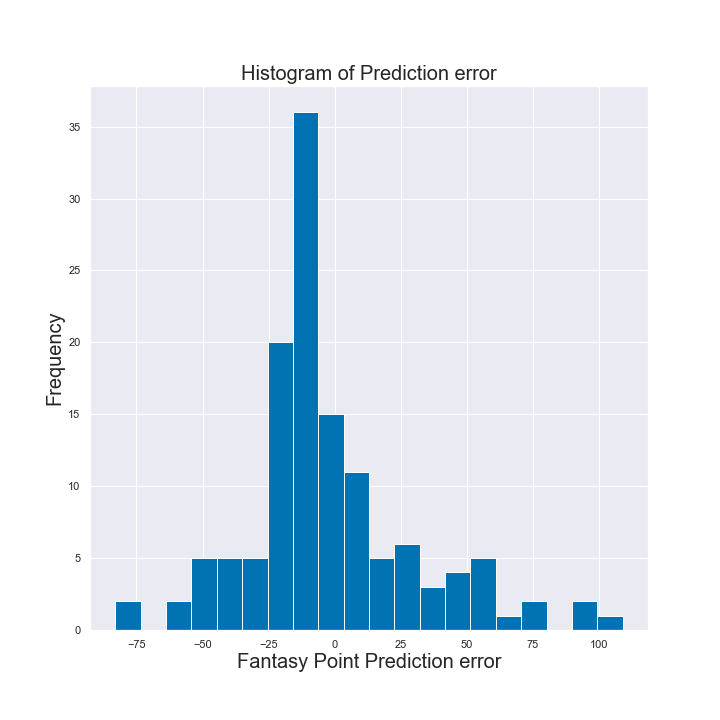

# Fantasy Football - Points Prediction Project

**Author**: [Vlad Sekiguchi](mailto:vlsekig@gmail.com)

## Overview

For this project, we compare the Root Mean Square Error ("RMSE")of the same dataset with varying degrees of features. The difference in features will be explained in the 'Data' section. The RMSE compared was between a dummy, linear regression, ridge, lasso, and random forest model.

This project was originally inspired by [Ben Dominguez](https://www.opensourcefootball.com/posts/2021-01-21-nfl-game-prediction-using-logistic-regression/) project which models NFL game outcomes. I was going to try using the same library 'nflfastpy', but it seems that it's been altered in the past two years and would not work the way it was outlined in his paper.

## Business Problem
The fantasy football industry is worth billions of dollars. Being able to pick players that produce more points is incredibly valuable. With that in mind we want to be able to take a player's first half of the season and predict their fantasy point total for the second half. Additionally, is more information better and what are the most important coefficients? We provide these answers to fantasy sports edgeseekers.

## Data
This project uses 7,169 regular season games that were played in the 2022-2023 season. This data was scraped from [The Football Database](https://www.footballdb.com/index.html) and turned into a csv. This dataset can be found in the general folder named as: offense_nfl_2022.csv.

The data was then cleaned to only have players that played both the first and second half of the season. This took us from 557 players to a total of 517 players to analyze.

The dataset was then made into four different versions:

Dataset Num: Only had numerical values, such as passing yards, rushing yards, receiving touchdowns, etc

Dataset NP: Everything Num has plus the player's position

Dataset NPT: Everything NP has plus the player's team

Dataset NPTO: Everything NPT has plus the opposing team

## Methods
To analyze the difference between datasets the RMSE of a dummy model that only picks the mean was used as the baseline. Each dataset was then put through a grid search of linear regression, ridge, lasso, and random forest models.


## Results

During cross validation with the training sets the Dataset NPT performed the best with a ridge model and a RMSE score of 29.79. The Dataset NPTO was only marginally worse with a RMSE score of 29.80.

Image comparing RMSE scores

The ridge model with the test set then achieved a RMSE of 31.49. It's important to have some context around this. The range in fantasy football points in the test set went from 0.00 to 194.74. A score of 31.49 means that the average difference between the actual values and the values predicted by the model are around 31 points off.


## Top 5 Predictive Features - Positive Coefficients


## Second Half of the Season - Fantasy Points Actual vs Predicted


## Second Half of the Season - Histogram of predicted errors



## Conclusion

Given the range of fantasy points in the test set, an RMSE of 31.49 is a little high, but on the higher end of the spectrum is not bad at all. In the 150-190 point range if the prediction was off by 30 points then that would only be around a 10%-20% miss. Additionally, as we can see in the histogram above the majority of the errors were very small. Having said that there is much room for improvement and trying to see how features can be added or enhanced via engineering.

To further this test it would be best to try it out in a live setting, but instead of trying to predict an entire half of a season we would like to see how it could do game to game.


## Next Steps
The closer the RMSE is to 0 the better it'll be for our predictions. In order to continue iterating on the models and trying to improve their score I'd try adding more features such as temperature, home/away, etc. If adding more features doesn't seem to be helping as much, then I'd have to try feature engineering. Some examples of this would be trying polynomial features, 'conv%', 'target to TD ratio', etc.

In conjuction, I'll be developing a Streamlit demo application, so that someone can just pick a player and see what the model is predicting for next week. Is the machine better than the average joe? Stay tuned to find out!

## For More Information
See the full analysis in the [Jupyter Notebook](https://github.com/vladiseki/NFL_Capstone/blob/main/Fantasy_Football_Capstone.ipynb)

or review this [Presentation]

## Repository Structure
```
├── images
├── Fantasy_Football_Capstone.ipynb
├── Proof_of_concept.ipynb
├── LICENSE
├── README.md
```